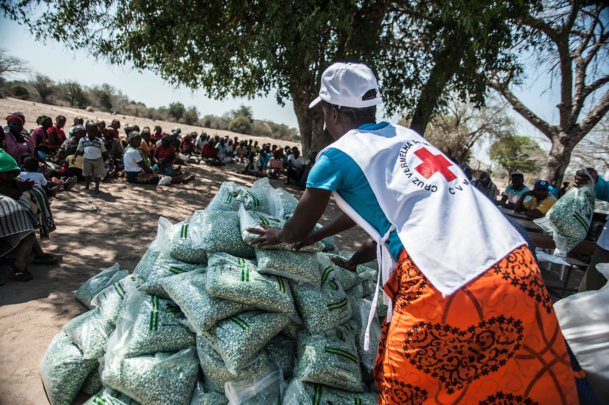

## Darren Gidado's Data Scientist Portfolio

<!-- Project 1 -->

<a href="https://github.com/ags911/udacity-dsnd/blob/main/project-1"><a/> **[Project 1: Write A Data Science Blog Post](https://github.com/ags911/udacity-dsnd/blob/main/project-1/predicting_airbnb_prices_in_boston.ipynb)**

Airbnb is a popular way for home owners to make money by renting out their properties or even spare rooms in their own home. 
More people are considering joining Airbnb to profit by investing in new properties to transform into Airbnbs. 
But how will they know what to consider to make their property an attractive proposition for customers? And how will they increase profit?
  

<!-- Project 2 -->
  
<a href="https://github.com/ags911/udacity-dsnd/tree/main/project-2"><a/> **[Project 2:  Disaster Response Pipeline Project](https://github.com/ags911/udacity-dsnd/tree/main/project-2)**  
  
In this project, we used data engineering skills to analyze disaster data from Figure Eight. This data was used to build a model for an API that classifies disaster messages. A machine learning pipeline was created to categorize these events so that the messages could be sent to an appropriate disaster relief agency. This project also includes an interactive web app.
